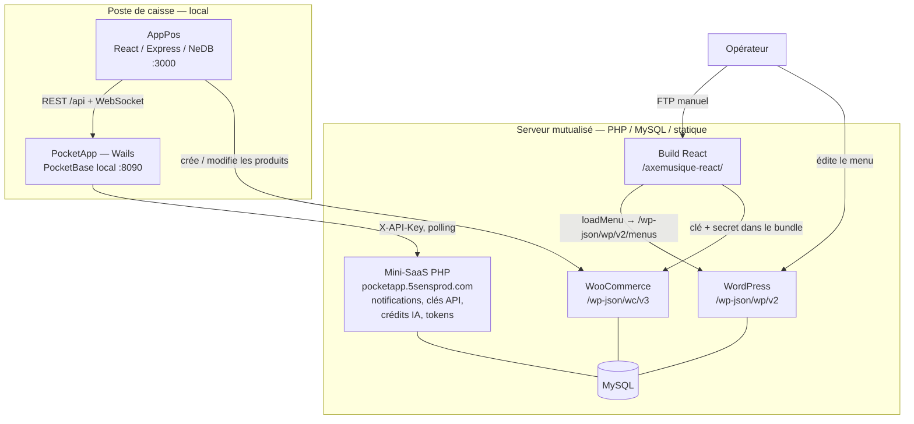

# Audit du flux de données — résultats

**Date :** 6 août 2026
**Périmètre :** flux de la donnée entre AppPos, PocketApp, le serveur mutualisé
et axemusique.shop, en vue de sortir le menu de navigation de WordPress.

Ce document remplace les affirmations de `00-contexte.md` partout où le code
les contredit. `00-contexte.md` a été corrigé en conséquence.

---

## 0. Comment lire ce document

Trois niveaux de fiabilité sont distingués, parce que tout n'a pas été vérifié
au même degré :

- **Constaté** — lu dans le code, référence de fichier donnée.
- **Déclaré** — rapporté par le propriétaire du projet, non vérifié dans le code.
- **Non vérifié** — supposé, listé en section 7.

Les dépôts concernés sont au nombre de trois, et un seul a été lu intégralement.

| Dépôt | Chemin | Couverture de l'audit |
|---|---|---|
| PocketApp | `I:\pockapp\` | chaîne partant de `ProductTable.tsx` uniquement |
| Site React | `I:\divi-child\frontend-wp\` | `services/`, `utils/constants.js` |
| AppPos | non consulté | aucune |
| Serveur mutualisé | non consulté | `README` d'installation seulement |

---

## 1. Le flux réellement constaté

### 1.1 Schéma

### 1.2 Qui détient quoi

| Donnée | Autorité | Copies |
|---|---|---|
| Produits | AppPos (NeDB) | WooCommerce, PocketBase local |
| Catégories, marques, fournisseurs | AppPos | WooCommerce, PocketBase local |
| Menu de navigation | WordPress | cache `localStorage` du navigateur |
| Notifications, clés API, crédits IA | MySQL distant | cache local PocketApp |
| Médias | Médiathèque WordPress | — |

AppPos est la seule application qui écrit dans WooCommerce (**déclaré**).
PocketApp n'écrit aujourd'hui vers le distant que de la télémétrie
(notifications lues, consommation IA) — jamais de donnée catalogue.

### 1.3 Points d'entrée réseau de PocketApp

Deux, et deux seulement, pour toute la donnée catalogue :

1. **PocketBase** — [`frontend/lib/use-pocketbase.ts:5`](../../../lib/use-pocketbase.ts)
   `http://127.0.0.1:8090` sous Wails, sinon `document.location.origin` avec
   le proxy Vite ([`vite.config.ts:11,31`](../../../../vite.config.ts),
   variable `VITE_BACKEND_URL`).
2. **AppPos** — [`frontend/lib/apppos/apppos-config.ts:5`](../../../lib/apppos/apppos-config.ts)
   `VITE_APPPOS_URL`, sinon `http://127.0.0.1:3000` sous Wails,
   sinon `{origin}:3000`. Consommé par `fetchAppPos()`
   ([`apppos-api.ts:26`](../../../lib/apppos/apppos-api.ts)), jeton Bearer en
   `sessionStorage`.

À quoi s'ajoute le canal Go vers le mini-SaaS distant :
[`remote_notifications.go:27`](../../../../remote_notifications.go),
`http://pocketapp.5sensprod.com/api/notifications.php`, en-tête `X-API-Key`,
poller démarré au lancement.

---

## 2. Écarts entre le contexte initial et le code

Ces écarts sont la raison d'être de ce document. Ils ont été corrigés dans
`00-contexte.md`, ils sont conservés ici pour mémoire.

### 2.1 PocketBase local était absent du tableau de stack

`00-contexte.md` décrivait AppPos comme unique backend. En réalité PocketApp
est une application **Wails** qui embarque son propre PocketBase (SQLite) —
`main.go`, `proxy.go`, volume `pb_data`. C'est un choix assumé et acquis, pas
une question ouverte.

**Conséquence sur la « question ouverte SQLite ou JSON » :** elle était mal
posée. Elle mélangeait deux couches sans rapport. Voir section 4.

### 2.2 « AppStock : existant, lecture seule » — faux

`frontend/lib/queries/products.ts` expose `useCreateProduct`,
`useUpdateProduct`, `useDeleteProduct`, `useUpdateAppPosProduct`.
`ProductTable.tsx:59` importe effectivement `useDeleteProduct`. AppStock écrit,
vers PocketBase **et** vers AppPos.

### 2.3 Le double accès parallèle existe déjà

`00-contexte.md` le présentait comme un risque à éviter. C'est une dette déjà
contractée : [`products.ts:180`](../../../lib/queries/products.ts)
`useUpdateProductUniversal` route vers AppPos ou PocketBase selon
`collectionId === 'apppos_products'`. La chaîne d'écriture dépend d'une chaîne
de caractères non typée.

### 2.4 « axemusique.shop : site React » — à préciser

Le site est **hybride au niveau du routage**. Le `.htaccess` racine sert React
en priorité, mais exclut explicitement du catch-all : `wp-admin`, `wp-content`,
`wp-includes`, `wp-json`, `panier`, `mon-compte`, `commander`, `contact`.

Les routes `panier`, `mon-compte` et `commander` sont donc **réservées à
WooCommerce dans la configuration du serveur**. Mais le site est une **vitrine
sans vente en ligne** : ces routes ne portent aucun usage commercial réel.

**Conséquence, et elle est favorable.** Il n'y a pas de tunnel d'achat à
préserver. WooCommerce n'est utilisé que comme **catalogue en lecture** —
produits, catégories, marques. La sortie éventuelle de WooCommerce n'est donc
pas bloquée par du paiement, des comptes clients ou des commandes : c'est un
problème de lecture de données, pas de transaction. Ces exclusions du
`.htaccess` sont un reliquat de configuration, pas une contrainte métier.

### 2.5 AppPos communique aussi en WebSocket

`apppos-websocket.ts` et `apppos-hooks-websocket.ts` — `useAppPosStockUpdates`,
`useAppPosProductUpdates`. Le lien AppPos → PocketApp est temps réel, pas
seulement REST. Non mentionné dans le contexte initial.

### 2.6 `/menus` n'est pas un endpoint WordPress standard

`API_CONFIG.baseURL` vaut `https://axemusique.shop/wp-json/wp/v2`
([`constants.js:3`](file:///I:/divi-child/frontend-wp/src/utils/constants.js)),
donc `loadMenu()` appelle `/wp-json/wp/v2/menus`. **Le cœur de WordPress
n'expose pas cette route.** Elle provient d'un plugin ou du `functions.php` du
thème enfant.

C'est la dépendance la plus fragile du flux actuel, et la moins documentée. Si
ce plugin est désactivé, le menu du site disparaît — voir 3.4.

> **Correction du 7 août 2026 — ce n'est pas un plugin.** La route est
> enregistrée par le **thème enfant** :
> [`child/functions.php:86`](file:///I:/divi-child/child/functions.php),
> `register_rest_route('wp/v2', '/menus', …)` avec
> `'permission_callback' => '__return_true'` (donc publique, sans
> authentification), la charge utile étant construite par `get_menus_data()`
> juste en dessous (`:94-117`) — `wp_get_nav_menus()` puis
> `wp_get_nav_menu_items()`, aplati en `{id, title, url, parent}`, exactement la
> forme que §6.3 de `05-contrat-menu.md` avait lue côté site.
>
> **Ce que ça change :** la dépendance n'est pas un plugin à ne pas désactiver,
> c'est **le thème enfant à ne pas remplacer ni écraser** avant le ticket 9. Le
> risque de 3.4 est inchangé, sa cause est identifiée.
>
> Constaté, lu dans le dépôt `I:\divi-child`, ouvert le 7 août 2026 en
> lecture seule. Ferme la première question ouverte de §7.2.

---

## 3. Failles retenues

Classées par gravité. Les deux premières sont indépendantes de la refonte et
plus urgentes qu'elle.

### 3.1 — CRITIQUE — Les secrets WooCommerce sont dans le bundle public

[`woocommerce.js:28-38`](file:///I:/divi-child/frontend-wp/src/services/woocommerce.js) :

- `VITE_WC_CONSUMER_KEY` et `VITE_WC_CONSUMER_SECRET` sont lus via
  `import.meta.env`. **Tout ce qui est préfixé `VITE_` est inliné en clair dans
  le JavaScript livré au navigateur.** N'importe qui peut les lire dans
  `/axemusique-react/assets/*.js`.
- `queryStringAuth: true` place ces identifiants **en paramètres d'URL**, donc
  dans les journaux d'accès du serveur, les journaux de tout intermédiaire, et
  l'en-tête `Referer`.
- `woocommerce.js:5-10` journalise au chargement du module les six premiers
  caractères de la clé et du secret dans la console du navigateur, en
  production comme en développement.

Le même problème vaut pour WordPress : `VITE_WP_USER` et
`VITE_WP_APP_PASSWORD` ([`constants.js:11`](file:///I:/divi-child/frontend-wp/src/utils/constants.js))
alimentent une authentification Basic depuis le client.

**Portée.** Une clé WooCommerce en écriture permet de modifier le catalogue et,
selon les permissions accordées, de lire les commandes — donc des données
clients.

**Action recommandée, hors périmètre du MVP mais prioritaire sur lui :**
vérifier dans WooCommerce si la clé est en lecture seule ou en lecture-écriture,
la révoquer et la réémettre en lecture seule, retirer le `console.log`. La
solution durable est un proxy PHP côté serveur qui détient le secret — ce qui
rejoint l'architecture cible de la section 4.

### 3.2 — MAJEURE — Les catégories sont tronquées silencieusement

[`woocommerce.js:152-162`](file:///I:/divi-child/frontend-wp/src/services/woocommerce.js) :
`getCategories()` demande la page 1 puis la page 2, à 100 par page, **en dur**.
Plafond : 200 catégories. Le catalogue en compte environ 200.

Le projet est donc au bord du seuil, sans alerte. La 201ᵉ catégorie créée
n'apparaîtra jamais sur le site, sans erreur, sans journal, sans symptôme autre
qu'une absence. `getBrands()`, juste au-dessus, gère pourtant correctement la
pagination via l'en-tête `x-wp-totalpages` — le savoir-faire est présent dans le
fichier, il n'a pas été appliqué ici.

### 3.3 — MAJEURE — Trois copies des référentiels, aucune réconciliation

Catégories, marques et fournisseurs existent dans NeDB (AppPos), dans MySQL
(WooCommerce) et dans PocketBase local. Aucun mécanisme ne vérifie leur
concordance. Une divergence n'est pas détectée : elle est constatée quand
quelque chose s'affiche mal.

### 3.4 — MAJEURE — Le menu n'a pas de repli

[`wordpress.js:72-77`](file:///I:/divi-child/frontend-wp/src/services/wordpress.js) :
`loadMenu()` propage l'erreur (`throw`) en cas d'échec. Or `DEFAULT_DATA.menus`
existe dans `constants.js:28` et n'est **jamais utilisé** — contrairement à
`loadSiteData()` juste au-dessus, qui retombe proprement sur ses valeurs par
défaut.

Conséquence : plugin de menus désactivé, WordPress en maintenance ou `/wp-json`
inaccessible, et la navigation du site casse. Le repli est écrit, il suffit de
le brancher.

> **Précision du 7 août 2026 :** « plugin de menus désactivé » se lit
> désormais « thème enfant remplacé ou écrasé » — la route vient de
> `child/functions.php:86`, pas d'un plugin (voir 2.6). Le reste est inchangé.

### 3.5 — MOYENNE — L'autorité est l'application destinée à disparaître

AppPos, première itération du logiciel de caisse, reste source de vérité alors
que PocketApp est sa refonte. Chaque fonctionnalité de PocketApp qui lit AppPos
alourdit la bascule finale. Coût croissant avec le temps.

### 3.6 — MOYENNE — Cache du menu sans durée de vie apparente

`loadMenu()` utilise `cacheUtils.get(CACHE_KEYS.MENU)` (`wordpress.js:47`), pas
`getWithTTL()` comme le fait `woocommerce.js` ailleurs. Sous réserve de lecture
de `utils/cache.js` — non consulté —, le menu resterait en `localStorage`
jusqu'à purge manuelle.

**Impact direct sur le MVP :** au moment de basculer la source du menu, un
visiteur au cache chaud continuerait de voir l'ancien menu. À traiter au
ticket 8, sans quoi la bascule paraîtra ne pas fonctionner.

### 3.7 — MOYENNE — Déploiement sans retour arrière

Build local puis dépôt FTP dans `/axemusique-react/`. Pas de CI, pas de trace
de ce qui est en ligne, pas de version précédente à restaurer. Un mauvais build
écrase le bon.

Ceci pèse sur le choix d'architecture : il faut une couche de données dont on
puisse annuler une publication **sans redéployer le site**.

### 3.8 — FAIBLE — Points de défaillance unique

AppPos éteint : PocketApp perd les produits. Mutualisé lent : le site l'est
aussi. Et après le MVP, le poste de caisse devient autorité de publication du
menu — s'il tombe, le menu n'est plus modifiable, sauf à rouvrir `wp-admin`.
D'où la recommandation de ne rien supprimer côté WordPress pendant la
transition.

---

## 4. Architecture retenue

### 4.1 La distinction qui était confuse

Deux couches de données sans rapport étaient confondues dans le cadrage
initial. Elles sont ici nommées séparément, une fois pour toutes :

| | Couche locale | Couche distante |
|---|---|---|
| **Où** | poste de caisse | serveur mutualisé |
| **Quoi** | PocketBase / SQLite, embarqué dans Wails | à construire |
| **Statut** | acquis, non rediscuté | objet de cette décision |
| **Rôle** | stockage de travail de PocketApp | source de données du site |
| **Lecteur** | PocketApp | axemusique.shop |

« SQLite ou JSON » ne concerne **que la couche distante**. La couche locale est
déjà du SQLite via PocketBase et le reste.

### 4.2 Contrainte éliminatoire

Hébergement mutualisé : PHP, MySQL, fichiers statiques. Aucun processus
persistant. Fly.io n'est plus actif.

Sont donc hors de portée, définitivement tant que l'hébergement ne change pas :
PocketBase distant, API Node ou Express, Docker, WebSocket côté serveur, et
tout démon. Un fichier SQLite distant est également écarté — il ne se sert pas
de façon fiable depuis du PHP mutualisé, faute de verrouillage correct.

### 4.3 Options examinées

**Option A — JSON statique déposé par PHP.**
PocketApp pousse le menu en HTTP vers un script PHP protégé par `X-API-Key`.
Le script valide et écrit un fichier `menu.json`. Le site lit ce fichier
directement, en statique, **sans PHP sur le chemin de lecture**.

- Effort faible, risque faible, réversibilité totale.
- Limite : aucun requêtage, tout est chargé en bloc.

**Option B — MySQL avec endpoints PHP en lecture et en écriture.** *Écartée.*
Elle paie le coût de MySQL et le paie **sur le chemin de lecture du site** —
c'est-à-dire qu'elle réintroduit en plus petit exactement ce qui rend
WordPress lent aujourd'hui. On ne quitte pas un intermédiaire PHP+MySQL pour
en rebâtir un.

**Option C — MySQL en stockage, JSON statique en lecture.**
La publication écrit en MySQL (historique, versions, retour arrière) **et**
régénère un `menu.json` statique. Le site ne lit que le fichier.

- Risque de lecture identique à A, puisque la lecture reste statique.
- Apporte l'historique et l'annulation de publication sans redéploiement —
  réponse directe à la faille 3.7.

### 4.4 Décision

**A pour le MVP. C ensuite. B jamais.**

Le raisonnement, qui est la seule vraie décision d'architecture ici :

> Ce qui engage n'est pas le stockage, c'est le **contrat** — l'URL appelée par
> le site et la forme du JSON reçu. Le contrat est coûteux à changer parce
> qu'il vit dans un build déployé par FTP sans retour arrière (faille 3.7). Ce
> qui se trouve derrière l'URL — fichier ou base — se remplace en une
> après-midi sans que le site s'en aperçoive.

Donc : soigner le contrat maintenant, prendre le stockage le plus simple
possible.

**Ce que le contrat doit prévoir dès le premier jour** — trivial à inclure
maintenant, très pénible à rétro-ajouter quand un build en production dépend de
leur absence :

| Champ | Raison |
|---|---|
| version de format | permettre au site de refuser un format qu'il ne comprend pas |
| horodatage de publication | diagnostiquer « le menu n'est pas à jour » |
| arbre des entrées | la donnée elle-même |

L'arbre est **libre** : entrées, sous-menus, ordre, libellés, liens, visibilité
sont gérés indépendamment dans PocketApp. Catégories, marques et produits
peuvent servir de destinations sans imposer la structure.

### 4.5 Ce qui déclenche le passage de A à C

À surveiller ; le premier atteint déclenche la bascule.

1. **La couche distante doit accueillir les produits.** Déclencheur principal et
   attendu. Environ 2000 produits ne se servent pas en un seul fichier chargé
   intégralement par le navigateur.
2. **Un besoin de retour arrière sur publication se manifeste** — une mauvaise
   publication de menu qu'il faut annuler sans reconstruire le site.
3. **Un second poste doit pouvoir publier.** Il faut alors arbitrer les
   écritures concurrentes, ce qu'un fichier ne sait pas faire.
4. **Le fichier publié dépasse quelques centaines de kilo-octets.** Seuil
   indicatif, à réévaluer sur mesure réelle.

Le passage de A à C **ne modifie pas le site** : l'URL et le format ne bougent
pas, seule la production du fichier change. C'est précisément l'intérêt d'avoir
figé le contrat.

### 4.6 Médias

Aucune des options ne change quoi que ce soit à la gestion des médias. La
médiathèque WordPress reste en place, les URL d'images restent des URL WP.
C'est délibéré : c'est le seul service que WordPress rend réellement.
Les médias n'ont donc pesé dans aucun arbitrage.

---

## 5. Tickets du MVP

Chacun est mergeable seul sans casser la production. Les tickets 1 à 5 n'ont
**aucun effet observable** sur le site.

| # | Ticket | Dépend de | Dépôt | Effet en production |
|---|---|---|---|---|
| 1 | Collection `site_menu` dans PocketBase local | — | PocketApp | aucun |
| 2 | Squelette du module AppSite et sa route | — | PocketApp | aucun |
| 3 | Contrat JSON publié : version, horodatage, arbre | — | doc partagée | aucun |
| 4 | Éditeur d'arbre libre : entrées, ordre, libellés, liens, visibilité | 1, 2, 3 | PocketApp | aucun |
| 5 | Endpoint PHP de réception, protégé par `X-API-Key` | 3 | serveur | aucun, rien ne l'appelle |
| 6 | Action « Publier le menu » dans AppSite | 4, 5 | PocketApp | écrit le fichier, personne ne le lit |
| 7 | Exposition du `menu.json` en lecture statique | 5 | serveur | fichier lisible, site inchangé |
| 8 | Bascule `.env` dans `loadMenu()`, **par défaut sur WordPress** + purge du cache et repli | 3, 7 | site | aucun tant que le drapeau est à zéro |
| 9 | Passage du drapeau par défaut sur la nouvelle source | 8 | site | le menu bascule — retour arrière par `.env` |

### Notes de mise en œuvre

**Ticket 3 avant le 4.** Décider de la forme publiée avant de coder l'éditeur
évite de modeler l'un sur l'autre par accident. C'est le seul réordonnancement
par rapport à l'intuition initiale.

**Tickets 5 et 7 : versionner le code serveur.** Ils touchent le mutualisé, pas
le dépôt PocketApp. Sans décision explicite, ce sera le seul maillon de la
chaîne non suivi par Git — exactement le genre d'angle mort qui coûte cher six
mois plus tard. Le mini-SaaS `pocketapp.5sensprod.com` a déjà cette structure
(`api/`, `admin/`, `schema.sql`) et le même modèle `X-API-Key` : s'en inspirer
plutôt que réinventer.

**Ticket 8 : c'est le vrai jalon.** À partir de là, les deux menus se comparent
côte à côte en changeant une variable. Trois choses à traiter ensemble :

- le drapeau `.env`, par défaut sur WordPress ;
- l'invalidation du cache `localStorage` (faille 3.6), sans quoi la bascule
  semblera sans effet chez les visiteurs au cache chaud ;
- le branchement de `DEFAULT_DATA.menus` en repli (faille 3.4), pendant qu'on
  est dans cette fonction.

**Ticket 9 : ne rien supprimer côté WordPress.** `wp-admin` reste capable
d'éditer l'ancien menu, inutilisé mais fonctionnel, jusqu'à ce que quelques
semaines de fonctionnement confirment la nouvelle source. C'est la porte de
sortie en cas de panne du poste de caisse (faille 3.8).

### Hors MVP, mais prioritaire sur lui

La faille 3.1 (secrets WooCommerce publics) ne fait partie d'aucun ticket
ci-dessus et devrait être traitée avant. Elle est indépendante de la refonte.

---

## 6. Explicitement reporté

Listé ici pour être ignoré sans hésitation. Ne pas anticiper.

- **Performance, SEO, cache, optimisation des images.**
- **Migration des produits** vers la couche distante. WooCommerce reste source
  de vérité du catalogue pendant toute la transition.
- **Bascule AppPos → PocketApp** des produits et référentiels. Dernière étape de
  la refonte.
- **Simplification du `.htaccess`.** Après la bascule du menu, jamais pendant.
  `wp-admin` et `wp-json` doivent rester exclus du catch-all React tant que
  WordPress sert le catalogue et la médiathèque. Les routes `panier`,
  `mon-compte` et `commander` sont inutilisées (voir 2.4) et pourront être
  nettoyées — mais pas dans ce MVP.
- **CI/CD du site.** Problème réel (faille 3.7), mais pas celui-ci.
- **PocketApp multi-poste et accès navigateur.** Un seul poste fait autorité.
- **Authentification au-delà de `X-API-Key`.** Le modèle existant suffit.
- **Historique et retour arrière des publications.** Arrive avec l'option C.
- **Réconciliation des trois copies de référentiels** (faille 3.3).

---

## 7. Ouvert ou non vérifié

### 7.1 Non vérifié dans le code

- **`utils/cache.js` du site** — non lu. La faille 3.6 (menu sans durée de vie)
  est déduite de l'appel `cacheUtils.get()` plutôt que `getWithTTL()`. À
  confirmer au ticket 8.
- **AppPos** — dépôt jamais ouvert. Tout ce qui le concerne est déclaré :
  qu'il est seul à écrire dans WooCommerce, qu'il alimente PocketBase local,
  qu'il est autorité sur les référentiels.
- **Le code serveur du mini-SaaS** — seul le `README` d'installation a été lu.
- **PocketApp au-delà de la chaîne `ProductTable.tsx`** — l'audit a suivi les
  imports de ce seul composant jusqu'aux points d'entrée réseau. D'autres
  chemins d'accès à la donnée peuvent exister ailleurs dans l'application.

### 7.2 Questions ouvertes

- ~~**Quel plugin expose `/wp-json/wp/v2/menus` ?** Non identifié.~~
  **Résolu le 7 août 2026 : aucun plugin.** C'est le thème enfant,
  `child/functions.php:86`. Voir la correction en 2.6.
- **La clé WooCommerce du bundle est-elle en lecture seule ?** Détermine la
  gravité réelle de la faille 3.1. À vérifier dans WooCommerce → Réglages →
  Avancé → API REST.
- ~~**Où versionner le code du serveur mutualisé ?**~~ **Tranché le 7 août
  2026 : `server/` dans PocketApp.** Bloc « Où vit le code du serveur
  mutualisé » de `docs/DECISIONS.md`.
- **`VITE_APPPOS_URL` n'est pas documentée** dans `.env.example`, qui ne
  contient que `VITE_BACKEND_URL`. La variable est pourtant lue par
  `apppos-config.ts:7`. À ajouter.
- **Le mot de passe admin par défaut du mini-SaaS** (`admin` / `admin123`, cf.
  son `README`) a-t-il été changé ? Le `README` l'exigeait ; rien ne confirme
  que ce fut fait.

### 7.3 Ce que ce document ne tranche pas

**La sortie complète de WooCommerce comme catalogue.** Le MVP ne traite que le
menu ; les produits, catégories et marques continuent de venir de WooCommerce.
Le chemin d'après — publier le catalogue depuis PocketApp vers la couche
distante — est esquissé (option C, section 4.3) mais pas étudié : ni le volume
réel une fois publié, ni la stratégie d'images, ni la recherche côté site.

Le site étant une **vitrine sans vente en ligne** (voir 2.4), cette sortie ne
se heurte à aucun tunnel d'achat, aucun compte client, aucune commande. C'est
un problème de lecture de données. C'est ce qui la rend envisageable — mais
elle reste à concevoir.

**Le statut des routes `panier`, `mon-compte`, `commander`.** Elles sont
réservées à WooCommerce dans le `.htaccess` alors qu'elles ne servent à rien.
Faut-il les retirer, les rediriger, ou les laisser ? Non tranché. Sans urgence,
mais à regarder au moment de la simplification du `.htaccess`, et à vérifier
côté référencement si ces URL sont indexées.
